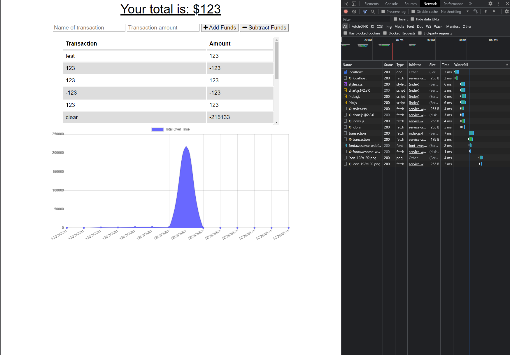
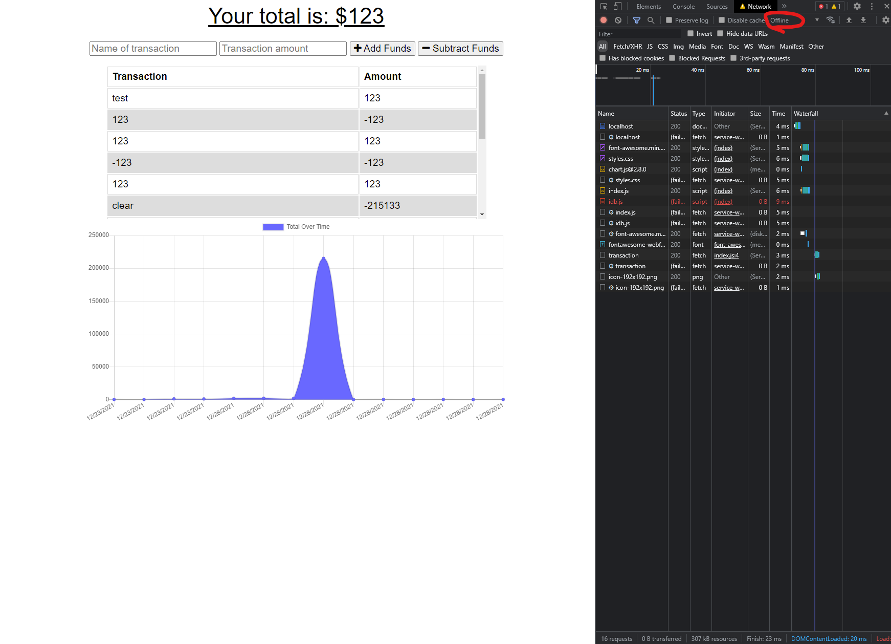
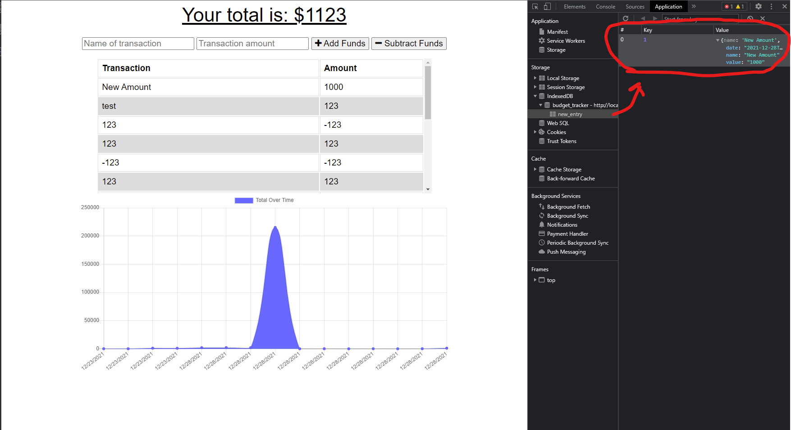
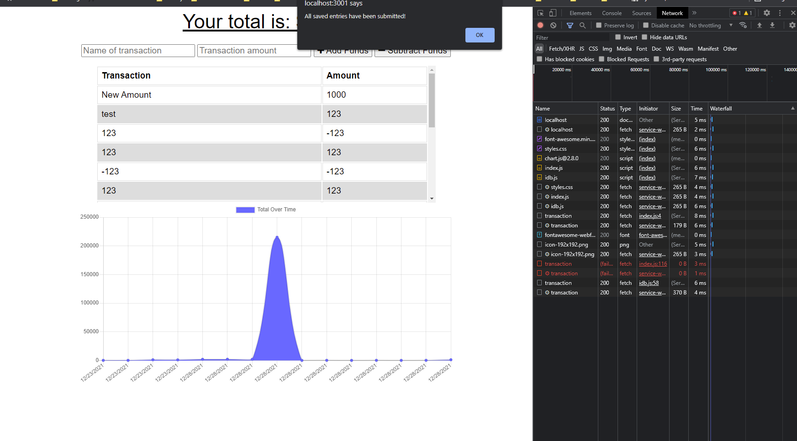

# 19 Progressive Web Applications (PWA): Budget Tracker

Your challenge this week is to add functionality to an existing budget tracker application to allow for offline access and functionality. The user will be able to add expenses and deposits to their budget with or without a connection. When entering transactions offline, they should update the total when brought back online. Finally, you’ll deploy the application to Heroku.

## Steps

* Created the github repository
* Cloned provided code
* installed libraries used
* Created the service-worker file
* Created the manifest.json
* installed the service worker into the index.html file
* Created the indexed DB file idb.js in the public/js folder
* Created all the offline functionality for persistence
* Tested the total functionality of the app

## Screenshots

Display when navigating to the home page.

Shows the app loading from cache.

Displays the ObjectStore with the offline added entry.

When you reconnect, the items in the ObjectStore are added to the database. You're given notification when completed.

## Links

* Deployed Url: https://limitless-journey-88725.herokuapp.com/

* Github: https://github.com/ToiletTakos/budget-tracker

